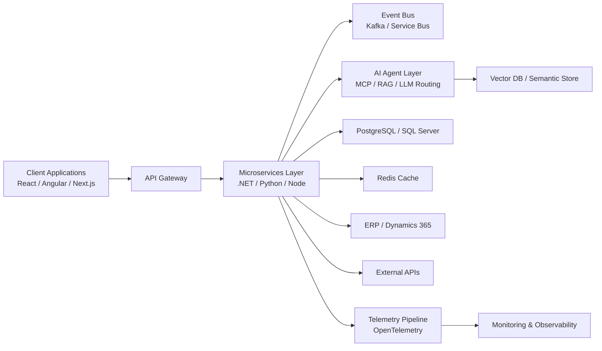

# Axelliant Software Engineering

---

## Engineering Manifesto

We believe modern systems must be intelligent, observable, secure, and automated.

At Axelliant, we architect platforms where:

- AI operates as infrastructure, not as a feature.
- Frontend is treated as a runtime, not a presentation layer.
- Cloud is defined in code.
- Observability exists before scale.
- Security is embedded at design time.
- Automation eliminates human drift.

We build systems that survive production.

---

# Who We Are

Axelliant is a global AI-first engineering company delivering distributed systems, ERP modernization, enterprise cloud architecture, and intelligent automation platforms across North America, Asia, and Europe.

We operate at the intersection of:

• Agentic AI  
• Distributed Systems  
• Enterprise ERP Transformation  
• Cloud-Native Infrastructure  
• Advanced Frontend Engineering  

---

# System Architecture Philosophy

This is the pattern we implement across intelligent enterprise systems.

---

# Core Engineering Capabilities

## Agentic AI & Autonomous Systems

- Multi-agent orchestration frameworks
- MCP (Model Context Protocol)
- Tool-augmented LLM execution
- RAG pipelines (hybrid retrieval)
- Vector search (pgvector patterns)
- Model routing & fallback
- Real-time streaming inference
- AI + ERP/CRM integration
- Event-driven AI pipelines
- Cost-aware AI infrastructure

We engineer AI systems that connect to real infrastructure — securely and observably.

---

## Frontend Engineering

### React Ecosystem
- React 18+
- Next.js (App Router, SSR, ISR)
- TypeScript-first architecture
- Micro-frontends (Module Federation)
- Streaming UI
- WebSocket real-time interfaces
- Edge rendering
- Advanced state management (Redux Toolkit, Zustand, React Query)
- Enterprise design systems

### Angular Ecosystem
- Angular 15+
- Nx monorepo architecture
- RxJS-driven reactive patterns
- Strict TypeScript mode
- Modular domain-based architecture
- Lazy loading & performance tuning
- Enterprise-scale frontend structuring

We build scalable frontend systems for large engineering teams.

---

## Backend & Distributed Systems

- .NET 8 / ASP.NET Core
- Python (FastAPI, async)
- Node.js (NestJS)
- Clean Architecture
- Domain-Driven Design (DDD)
- CQRS
- Event Sourcing
- gRPC
- Multi-tenant SaaS architecture
- Horizontal scaling patterns

---

## Cloud & Infrastructure

### Azure
- AKS
- Azure App Services
- Azure SQL
- Service Bus
- Event Hub
- Azure Functions
- Entra ID
- Application Insights

### AWS
- ECS / Fargate
- EKS
- Lambda
- RDS
- MSK (Kafka)
- SQS / SNS
- CloudWatch

---

## Infrastructure & DevOps

- Docker
- Kubernetes
- Helm
- Terraform
- Bicep / ARM
- GitHub Actions
- GitOps
- Blue-Green deployments
- Canary rollouts
- Secure dependency scanning
- Automated vulnerability detection

Manual deployments are unacceptable.

---

## Data & Streaming

- PostgreSQL
- SQL Server
- Redis
- Kafka
- High-volume ingestion pipelines
- Real-time telemetry systems
- Distributed job orchestration
- Time-series processing

---

## Security & Compliance

- OAuth2 / OIDC
- Azure AD / Entra ID
- Zero-trust design
- Secure API gateways
- PCI-aligned architectures
- Policy-based authorization
- Secrets isolation

Security is architecture.

---

# Enterprise Modernization

- Microsoft Dynamics 365 (Finance, SCM, Project Ops)
- ERP modernization
- API-first integration
- Payment system architecture
- Government-scale deployments
- Large logistics platforms

We modernize legacy systems into AI-augmented, cloud-native platforms.

---

# Open Source Commitment

Our public repositories reflect production practices:

- AI agent frameworks
- Cloud-native service templates
- Infrastructure baselines
- CI/CD automation libraries
- Secure backend scaffolds
- Observability-first starter kits

We publish what we use.

---

# Engineering Footprint

---

# Connect With Axelliant

Website: https://axelliant.com  
LinkedIn: https://www.linkedin.com/company/axelliant  
Contact: info@axelliant.com  

---

Axelliant Software Engineering  
Autonomous Systems. Distributed Intelligence. Cloud Discipline.
