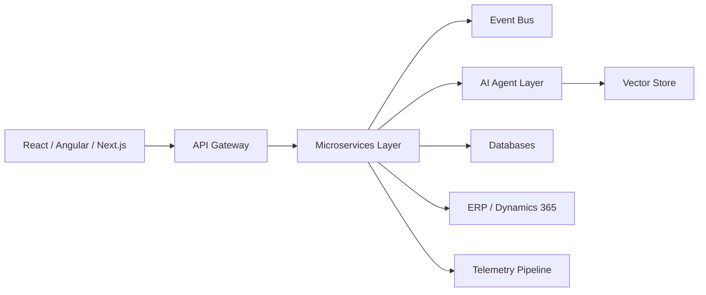

# Axelliant Software Engineering

AI-Native • Distributed Systems • Enterprise Cloud • ERP Modernization

---

## Engineering Manifesto

At Axelliant, we engineer systems where:

- AI operates as infrastructure.
- Cloud is defined in code.
- Frontend is treated as a runtime.
- Observability precedes scale.
- Security is embedded at design time.
- Automation eliminates human drift.

We build platforms that survive production.

---

# 🚀 Technology Landscape

## 🧠 AI & Intelligent Systems

- Agentic AI frameworks  
- MCP (Model Context Protocol)  
- Tool-augmented LLM systems  
- RAG pipelines  
- Vector search architectures  
- AI + ERP/CRM integration  
- Streaming inference systems  

---

## 🎨 Frontend Engineering

### React Ecosystem
- React 18+
- Next.js (App Router, SSR, ISR)
- Micro-frontend architectures
- Streaming UI
- Advanced state management

### Angular Ecosystem
- Angular 15+
- Nx monorepo structures
- RxJS-driven patterns
- Enterprise modular frontend architecture

Frontend is an execution layer — not decoration.

---

## ⚙ Backend & Distributed Systems

- Clean Architecture / DDD  
- CQRS  
- Event Sourcing  
- Multi-tenant SaaS systems  
- High-volume ingestion pipelines  
- Idempotent API design  

---

## ☁ Cloud & Infrastructure

- AKS / EKS  
- ECS / Fargate  
- Infrastructure as Code (Terraform, Bicep)  
- GitHub Actions CI/CD  
- Blue-Green & Canary deployments  
- Secure secret management  

Cloud is not hosting.  
Cloud is architecture.

---

## 🔐 Security & Governance

- OAuth2 / OIDC  
- Entra ID / Azure AD  
- Zero-trust architecture  
- PCI-aligned systems  
- Policy-based authorization  
- Automated dependency scanning  

Security is architectural — not procedural.

---

# 🏗 System Architecture Pattern

This is our production implementation model for AI-augmented enterprise platforms.

---

# 🏢 Enterprise Modernization

- Microsoft Dynamics 365 (Finance, SCM, Project Ops)
- ERP modernization strategies
- API-first integration
- Payment system architectures
- Government-scale deployments
- Logistics platform engineering

---

# 📊 Engineering Footprint

> 200+ internal repositories powering enterprise AI systems and distributed cloud platforms.

---

# 🌍 Connect With Axelliant

Website: https://axelliant.com  
LinkedIn: https://www.linkedin.com/company/axelliant  
Contact: info@axelliant.com  

---

Axelliant Software Engineering  
Autonomous Systems • Distributed Intelligence • Cloud Discipline
